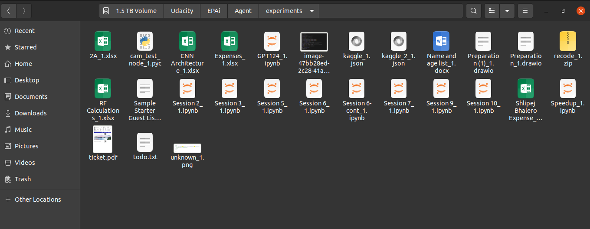
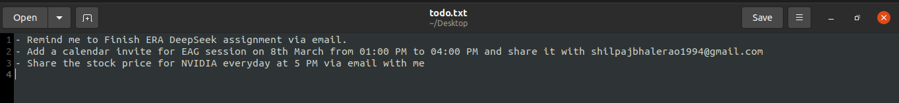
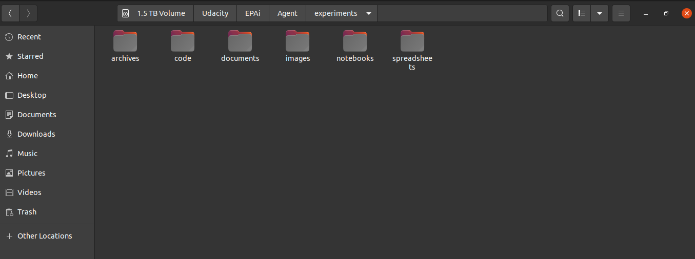
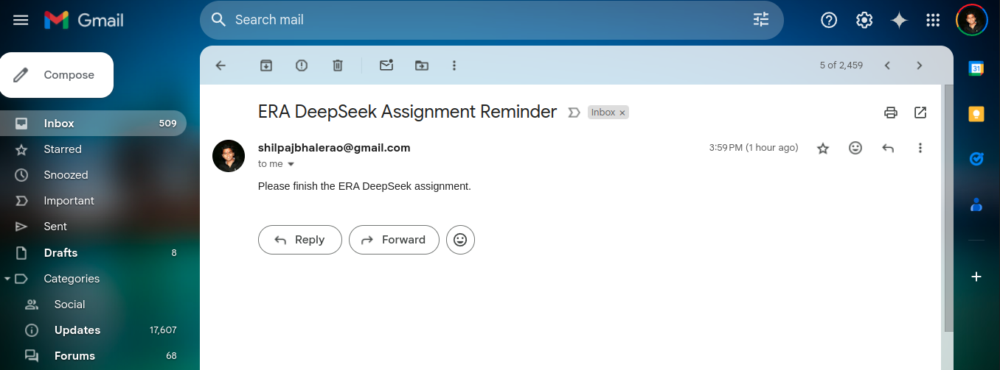
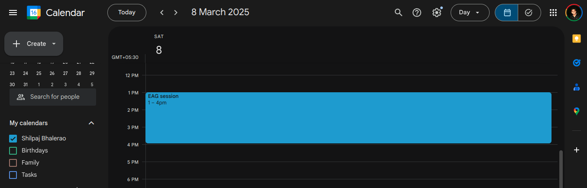
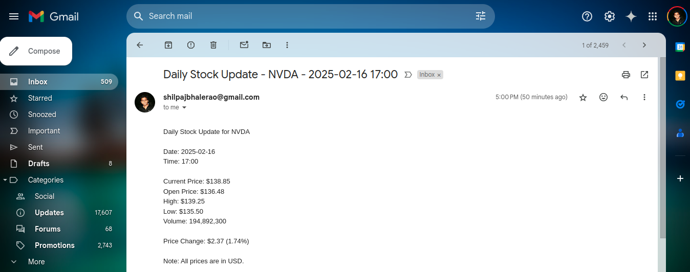

# Organizer Agent

In this project, an organizer agent is created to organize files in the different folders based on their categories. This agent is also used to send emails, create and share calendar invite and also share stock price everyday at specified time.


## Features

- [x] Take folder address as input
- [x] List all the files in that folder
- [x] Categorize the files into different folders based on their type
- [x] Use online service to compress the pdf files
- [x] Use online service to compress the images
- [x] If there's a file names `todo.txt` on the **Desktop**, read the file and process the tasks
    - [x] Send an email to the user at given time about the task
    - [x] Add a calendar invite for the mentioned date and shared it with the given address
    - [x] Share the stock price of the given stock at 5PM via email (daily)


---


## Setup 

This project uses `uv` for package management.  `uv` is a fast, reliable Python package installer and resolver, designed as a drop-in replacement for `pip` and `pip-tools`.

### 1. Install `uv`:

If you don't already have `uv` installed, you can install it via pip:

```bash
pip install uv
```


### 2. Project Setup with `uv`

   ```bash
# Navigate to the project directory
cd /path/to/your/project

# Create a virtual environment (optional but recommended)
uv venv

# Activate the virtual environment
source .venv/bin/activate  # On Linux/macOS
.venv\Scripts\activate    # On Windows

# Install dependencies
uv pip install -r requirements.txt
   ```


### 3. Environment Variables

You'll need to set the following environment variables.  The best practice is to create a `.env` file in the project root and store them there.  The `python-dotenv` package (included in `requirements.txt`) will automatically load these variables.

```bash
# GEMINI API Key for Gemini AI
export GEMINI_API_KEY='your_gemini_api_key'

# Convert API Key for PDF and Image compression
export COVERT_API_KEY='your_convertapi_key'
```

Replace `'your_gemini_api_key'`, `'your_convertapi_key'` with your actual API keys.

- **Gemini:** Obtain your API key from [Google AI Studio](https://ai.google.dev/).
- **ConvertAPI:** Sign up for an API key at [ConvertAPI](https://www.convertapi.com/).  This is used for PDF and image compression.


### 4. Google Cloud Project Setup (for Gmail and Calendar)

The `send_email` and `add_calendar_event` functions use the Google Gmail and Calendar APIs, respectively.  You'll need a Google Cloud project with these APIs enabled and credentials configured.

1.  **Create a Google Cloud Project:**

    *   Go to the [Google Cloud Console](https://console.cloud.google.com/).
    *   Create a new project or select an existing one.

2.  **Enable APIs:**

    *   In the Google Cloud Console, navigate to "APIs & Services" -> "Library".
    *   Search for and enable the following APIs:
        *   **Gmail API**
        *   **Google Calendar API**

3.  **Create Credentials:**

    *   Go to "APIs & Services" -> "Credentials".
    *   Click "Create Credentials" -> "OAuth client ID".
    *   Choose "Desktop app" as the application type.
    *   Give it a name (e.g., "Organizer Agent").
    *   Click "Create".
    *   Download the JSON file containing your credentials.  **Rename this file to `credentials.json` and place it in the `src/tools/internet_tools/` directory.**  This file is included in `.gitignore` to prevent accidental commits of your credentials.

4. **First time authentication:**
    * The first time you run the script, it will open the browser and ask for permissions.
    * Once you provide the permissions, it will create a `token.pickle` file in the `src/tools/internet_tools/` directory.


### 5. Running the Agent

Once you've completed the setup steps:

```bash
# Make sure you're in the project root and activate virtual environment
source .venv/bin/activate

# Run the agent
python src/agent.py
```


---


## Operation

### Unorganized Directory



and `todo.txt` on the **Desktop**




### Organizer Agent







